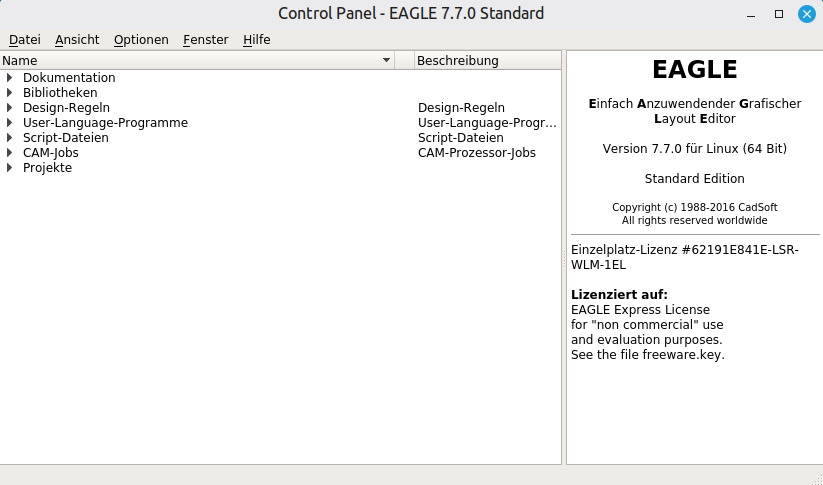

# eagle-bubblewrap
Run Cadsoft Eagle 7.7.0 in a up-to-date Linux distribution with
[bubblewrap](https://wiki.archlinux.org/title/Bubblewrap).


## Preface
Who knows not the good old times with an easy to handle Cadsoft Eagle.
In the mean time Cadsoft is Autodesk and the new licensing model is
challenging. Therefore the old Eagle should run on a current Linux
distribution forever.


## Prerequisite
* [bubblewrap](https://wiki.archlinux.org/title/Bubblewrap)
* [Eagle 7.7.0](https://community.element14.com/products/pcbprototyping/m/files/149125)
* [Ubuntu 14.04](https://releases.ubuntu.com/14.04/) rootfs


## Tested
* [Linux Mint 22.2](https://linuxmint.com/edition.php?id=322)


## Install

1) Install Bubblewrap and rootfs installer:
```bash
sudo apt update
sudo apt install bubblewrap
sudo apt install debootstrap
```

2) Create Ubuntu 14.04 rootfs
```bash
sudo mkdir -p /opt/eagle-7.7.0
sudo debootstrap --variant=minbase trusty /opt/eagle-7.7.0 http://archive.ubuntu.com/ubuntu/
```

3) Enter Ubuntu 14.04 bubblewrap environment with root rights for lib install
```bash
sudo bwrap \
  --bind /opt/eagle-7.7.0 / \
  --dev-bind /dev /dev \
  --proc /proc \
  --bind /sys /sys \
  --bind /tmp /tmp \
  --bind /tmp/.X11-unix /tmp/.X11-unix \
  --bind $HOME $HOME \
  --ro-bind /etc/passwd /etc/passwd \
  --ro-bind /etc/group /etc/group \
  --setenv DISPLAY $DISPLAY \
  /bin/bash
```

4) Check OS _(bubblewrap)_
```bash
cat /etc/os-release
```
Following output should appear
```bash
NAME="Ubuntu"
VERSION="14.04, Trusty Tahr"
ID=ubuntu
ID_LIKE=debian
PRETTY_NAME="Ubuntu 14.04 LTS"
VERSION_ID="14.04"
HOME_URL="http://www.ubuntu.com/"
SUPPORT_URL="http://help.ubuntu.com/"
BUG_REPORT_URL="http://bugs.launchpad.net/ubuntu/"
```

5) Install Eagle Libraries _(bubblewrap)_
```bash
apt update
apt install sudo bzip2
apt install -y \
  libxrender1 \
  libx11-6 \
  libfreetype6 \
  libfontconfig1 \
  libglib2.0-0 \
  libstdc++6 \
  libxrandr2 \
  libxcursor1 \
  libxi6 \
  libssl1.0.0 \
  libcups2 \
  libx11-xcb1
exit # leave bubblewrap
```

6) Copy Eagle installer
```bash
sudo cp ./eagle-lin64-7.7.0.run /opt/eagle-7.7.0/eagle-lin64-7.7.0.run
```

7) Allow X11 Connections
```bash
xhost +SI:localuser:$(whoami)
```

8) Re-enter bubblewrap for Eagle install
```bash
sudo bwrap \
  --bind /opt/eagle-7.7.0 / \
  --dev-bind /dev /dev \
  --proc /proc \
  --bind /sys /sys \
  --bind /tmp /tmp \
  --bind /tmp/.X11-unix /tmp/.X11-unix \
  --bind $HOME $HOME \
  --ro-bind /etc/passwd /etc/passwd \
  --ro-bind /etc/group /etc/group \
  --setenv DISPLAY $DISPLAY \
  /bin/bash
```

9) Install Eagle _(bubblewrap)_
```bash
chmod +x /eagle-lin64-7.7.0.run               # make exec
export QT_XKB_CONFIG_ROOT=/usr/share/X11/xkb  # forward keyboard
/eagle-lin64-7.7.0.run                        # start installer
```


## Starter

After the installation of EAGLE we need now to register the command
```eagle```.

1) create file with name ```eagle```
```bash
# create file
sudo touch /usr/local/bin/eagle
# set permission
sudo chmod 755 /usr/local/bin/eagle
```

2) open file with editor
```bash
sudo nano /usr/local/bin/eagle
```

3) and insert
```bash
#/bin/bash
bwrap \
  --bind /opt/eagle-7.7.0 / \
  --dev-bind /dev /dev \
  --proc /proc \
  --bind /sys /sys \
  --bind /tmp /tmp \
  --bind /tmp/.X11-unix /tmp/.X11-unix \
  --bind $HOME $HOME \
  --ro-bind /etc/passwd /etc/passwd \
  --ro-bind /etc/group /etc/group \
  --setenv DISPLAY $DISPLAY \
  --setenv QT_XKB_CONFIG_ROOT /usr/share/X11/xkb \
  /bin/bash -c '
    exec /opt/eagle-7.7.0/bin/eagle
  '
```

The usage of the sandbox environment forces no direct access accept the
paths mentioned with ```--bind```. If an additional folder is needed add
it after the line ```--bind $HOME $HOME \```. Following syntax uses
```--bind``` _--bind \<os\> \<sandbox\>_.

4) Finally start eagle
```bash
eagle
```

<center>  </center>

